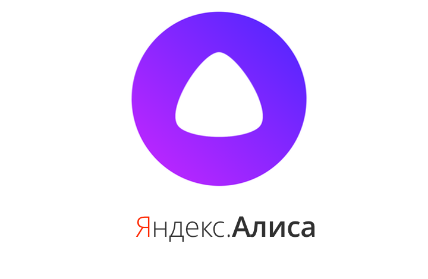

# Разговор с телегой. Яндекс.Алиса и Telegram.

  Telegram    |  Yandex Alise
:-------------------------:|:-------------------------:
 | 

Хочу представить сообществу Хабра свой достаточно старый Telegram бот, который связывает аккаунт Telegram и голосовой помощник Алиса от Яндекс.

[AlicaTalkBot](https://t.me/AlicaTalkBot) публикует в Telegram тексты фраз, продиктованных голосовому помощнику Яндекс.Алиса и отправляет ответы из Telegram в Алису.
Со стороны Алисы этот бот выглядит как [навык Алисы](https://dialogs.yandex.ru/store/skills/3e28e363-razgovor-s-telegoj/) "разговор с телегой".

В боте Telegram вам нужно задать "ключевую фразу" для своего аккаунта Telegram.
Эта фраза является связующим ключом для пересылки продиктованного Алисе текста именно в ваш аккаунт Telegram.

После этого вам нужно активировать навык Алисы "разговор с телегой" на любом устройстве, где доступен этот голосовой помошник.
Это можно сделать голосовыми командами

- "Алиса, запусти навык разговор с телегой"
- "Алиса, поиграем в разговор с телегой"

Когда навык запустится, он попросит у вас сообщить ключевую фразу для аккаунта Teltgram, с которым вы хотите начать сеанс связи.

Также можно начать сеанс связи одной голосовой командой, которая активирует навык и создает соединение с аккаунтом Telegram:

"Алиса, попроси разговор с телегой ваша-ключевая-фраза".

По умолчанию, продиктованные Алисе фразы появляются в приватном чате с AlicaTalkBot.
В Telegram боте можно настроить перенаправление этих фраз в любой групповой чат Telegram, где участвует AlicaTalkBot.

В Telegram можно отвечать на опубликованные фразы Алисы с цитированием.
В этом случае Алиса продиктует текст вашего ответа при следующем запросе от пользователя Яндекс Алисы.
Т.е. чтобы Алиса продиктовала вам текст ответа из Telegram, ее нужно постоянно переспрашивать :)
Это неудобно, но это ограничение Алисы, навык не может заставить Алису что то сказать по своей инициативе, только в ответ на запрос пользователя.

Код бота я не трогал года полтора или два, возможно сейчас ситуация в этом вопросе изменилась. Напишите в комментах, если это так.

Чтобы завершить сеанс связи, одна из сторон должна "повесить трубку".
Со стороны Алисы это можно сделать голосовой командой "завершить разговор", а со стороны Telegram - специальной кнопкой меню в приватном чате с AlicaTalkBot.
Если этого не сделать, то при попытке начать сеанс связи Алиса будет сообщать о том, что "абонент занят".

Также существуют проблемы с ключевыми фразами, которые содержат числа.
Для бота фразы "2 зайца" и "два зайца" - разные, в то время как для Алисы они произносятся одинаково.
Самый простой способ проверить, какой текст Алиса посылает боту в телегу - это произнести эту фразу Алисе в Яндекс-браузере (например).
Потом скопировать получившийся текст в телегу боту.

Вы можете сообщить вашу ключевую фразу своим друзьям, чтобы они также могли общаться с вами в Telegram через Алису.

Изначально бот делался, чтобы иметь резервный канал связи с дочерью для случая, когда нужно подать сигнал SOS, а телефон по какой-то причине недоступен.
Алиса сейчас доступна во многих публичных местах.

Спасибо за внимание.
