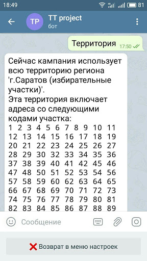
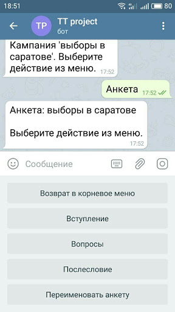
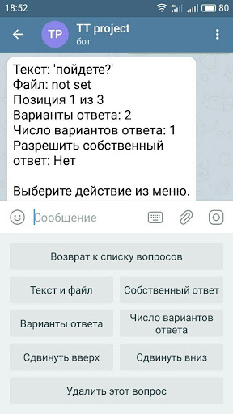
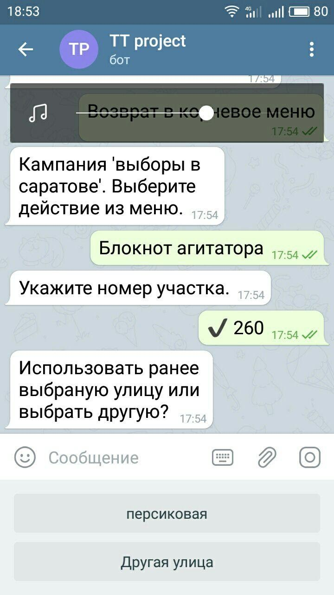
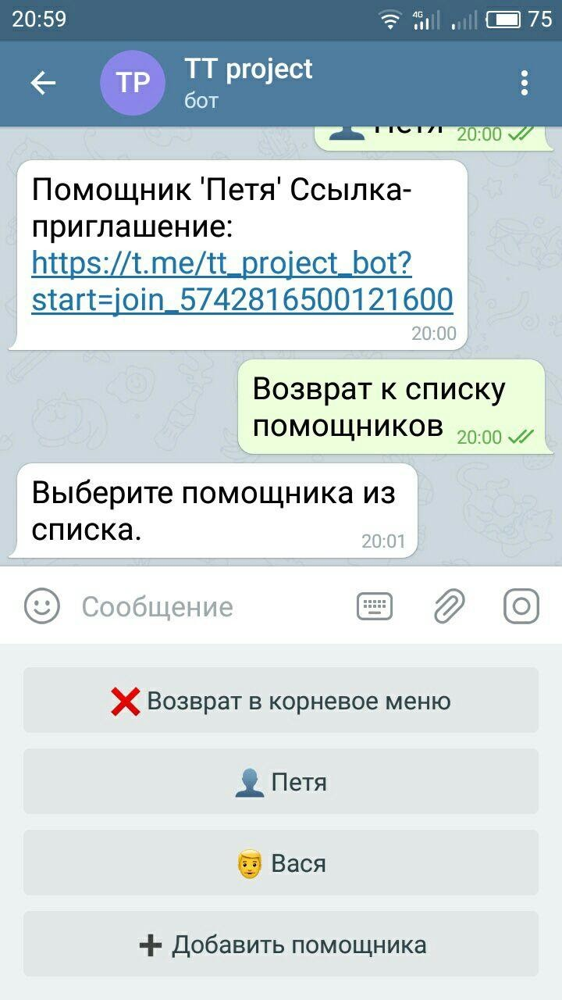

# Система поддержки поквартирных соцопросов и рекламных кампаний в Telegram

Предназначена для использования при проведении поквартирных опросов большим количеством сотрудников, позволяет координировать их работу,
получать в реальном времени данные о текущем ходе опросной кампании и сводные результаты.

Поддерживается иерархический принцип разделения доступа к данным согласно уровню сотрудника в иерархии.

Программа реализована в виде бота в мессенджере Telegram, функционирует на всех платформах,
поддерживаемых Telegram и не требует установки на устройство никакого дополнительного программного обеспечения, кроме мессенджера Telegram.

Рабочее название программы - "TT project".

## Регион опроса

При создании кампании-опроса нужно выбрать регион, в котором эта кампания будет происходить.
Регион представляет собой набор почтовых адресов с точностью до дома (улица, номер дома).
Этот набор разбит на части, представляющие собой более мелкие фрагменты территории региона.

В настоящий момент поддерживаются два региона:

- г.Саратов с разбиением по почтовым отделениям (индексам)
- г.Саратов с разбиением по избирательным участкам

Добавление новых регионов осуществляется разработчиками программы по запросу, т.к. не существует единого формата базы данных почтовых адресов для произвольного региона.

Существующие наборы данных почтовых адресов могут содержать ошибки и неточности.
Поэтому у сотрудников, проводящих опрос, есть возможность корректировать базу почтовых адресов, добавляя реально существующие, но отсутствующие в базе улицы и дома

## Территория опроса

Если созданная кампания проводится только на определенной части выбранного региона, существует возможность ограничить набор почтовых адресов,
сделав доступными только почтовые адреса для нужной части региона.

Это можно сделать в разделе "Территория", указав список номеров избирательных участков или почтовых отделений,
которые будут доступны сотрудникам при проведении опросов.

## Анкета

При создании кампании-опроса также необходимо создать анкету для данного опроса.
Это можно сделать через специальный редактор анкет.

В редакторе анкет можно задать вступительную и финальную часть, которые служат подсказками для сотрудника при проведении опроса,
а также набор вопросов, ответы на которые нужно зафиксировать в ходе опроса.

Редактор анкет позволяет: 

- создавать вопросы с произвольным количеством вариантов ответа
- собственными вариантами ответа анкетируемого ("открытый" вопрос)
- задавать произвольное количество вариантов, которое можно выбрать при ответе на конкретный вопрос("рейтинговый" вопрос)
- изменять порядок вопросов в анкете

## Процедура опроса домохозяйства(квартиры или частного дома) через "Блокнот агитатора"

После создания кампании-опроса, выбора региона и настройки анкеты, создатель может сразу проверить работу системы как сотрудник,
проводящий опрос, через раздел "Блокнот агитатора".

Первоначально запрашивается номер избирательного участка(почтового отделения), улица, номер дома и квартиры, где проводится попытка опроса.
Если по этому адресу уже проводились попытки опроса, то сотруднику доступны результаты этих предыдущих попыток.

Далее запрашивается результат текущей попытки опроса (состоялся контакт или нет) и отправка текущей геопозиции сотрудника.

Если контакт состоялся, сотрудник отвечает на вопросы анкеты, фиксируя ответы анкетируемого лица.

## Иерархия групп сотрудников

Создатель компании-опроса может создавать себе "помощников" для проведения работы.

Для каждого помощника задаются:

- условное имя
- список номеров избирательных участков или почтовых отделений, где будет проводить работу данный "помощник"
- возможность создавать собственных "помощников"

Для каждого "помощника" создается специальная ссылка-приглашение, которую нужно отправить в аккаунт Telegram конкретного человека,
который будет играть роль созданного помощника.

При переходе по этой ссылке и принятии приглашения, этому аккаунту Telegram будет доступна собственная "территория"
в виде назначенного ему списка номеров избирательных участков или почтовых отделений.

В свою очередь этот аккаунт Telegram может назначить себе собственных помощников (если это было разрешено на предыдущем уровне иерархии)
и распределить назначенную ему "территорию" между ними.
Глубина такой иерархии сотрудников не ограничена и регулируется только задаваемой возможностью создавать собственных "помощников".

На каждом уровне иерархии существует возможность отключить принявший приглашение аккаунт Telegram от соответствующего "помощника".
При этом отключенный аккаунт теряет доступ к текущим данным кампании и для соответствующего "помощника" создается новая уникальная ссылка-приглашение,
которую можно отправить другому аккаунту Telegram.

## Отслеживание работы сотрудников в реальном времени

Каждый сотрудник, имеющий возможность создавать собственных "помощников" может добавить бота @tt_project_bot в выбранный им канал Telegram и послать туда специальную команду.

После этого бот будет в реальном времени публиковать в данном канале данные о попытках опроса всех сотрудников находящихся ниже его в иерархии.

Эти данные включают:

- условное имя сотрудника
- ссылку на связанный с сотрудником аккаунт Telegram для возможности оперативной связи
- почтовый адрес проведенной попытки опроса
- геопозицию сотрудника (если он ее отправил)
- результат попытки

## Суммарные отчеты по кампании

Для каждого уровня иерархии можно создавать сводные отчеты по текущим результатам опросов для загрузки в MS Excel или другие программы анализа.

В настоящее время эта функциональность не реализована, т.к. требуется уточнение форматов, в котором нужно предоставлять данные.

## Возможность подключения дополнительных баз данных

В системе предусмотрена возможность (на данные момент не реализовано) подключать дополнительные базы данных,
в которых информация привязана к почтовым адресам либо к координатам геолокации.
При совпадении с задаваемой точность места проведения опроса и соответствующих записей из дополнительных баз данных,
информация из этих баз будет предоставляться сотруднику перед началом опроса.

Например, опрос проводится в доме, где имеются стационарные телефоны, по которым проводился автоматизированный телефонный опрос.
Результаты телефонного опроса для этого дома могут быть предоставлены сотруднику.
