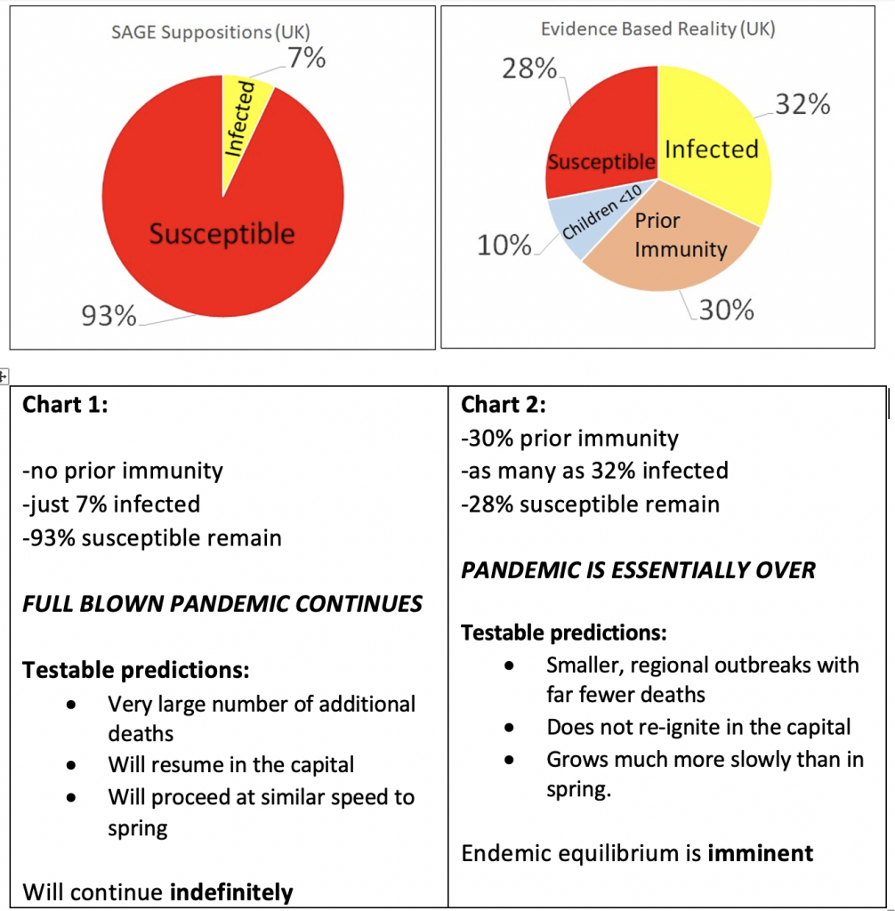
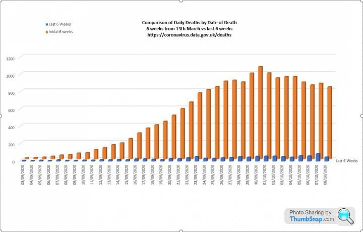
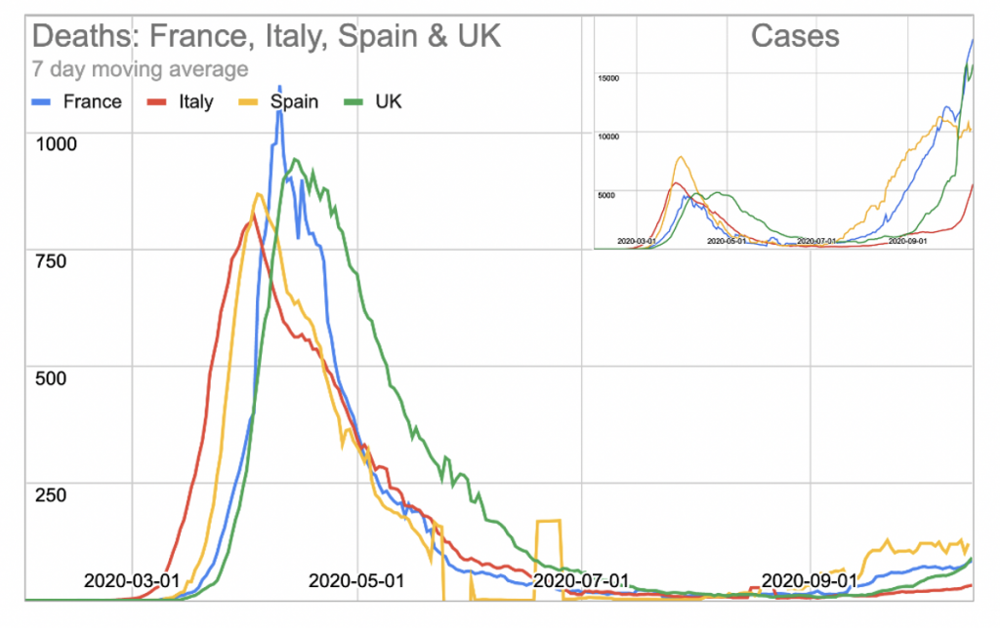

# What SAGE Has Got Wrong

https://web.archive.org/web/20201129113931/https://lockdownsceptics.org/what-sage-got-wrong/

16 октября 2020. Обновлено 21 октября 2020.

Майк Йедон (Mike Yeadon)

_Главный врач профессор Крис Уитти и главный научный советник сэр Патрик Валланс проводят брифинг по данным о коронавирусе на Даунинг-стрит, 10. Изображение Пиппы Фаулз / № 10 Даунинг-стрит._

“Обмануть людей легче, чем убедить их в том, что они обмануты.” – Марк Твен.

Доктор Майк Йидон имеет степень в области биохимии и токсикологии и докторскую степень в области респираторной фармакологии.
Более 30 лет он руководил исследованиями новых лекарств в крупнейших фармацевтических компаниях мира,
покинул Pfizer в 2011 году с должности вице-президента и главного научного сотрудника по аллергии и респираторным заболеваниям.
Это была самая высокая должность в этой области в Pfizer.
После ухода из Pfizer доктор Йедон основал свою собственную биотехнологическую компанию Ziarco, которая в 2017 году была продана крупнейшей в мире фармацевтической компании Novartis.

Аббревиатура SAGE означает "Scientific Advisory Group for Emergencies" - Научно-консультативная группа по чрезвычайным ситуациям Великобритании.

## Abstract

SAGE сделала - и продолжает делать - две фатальные ошибки в оценке пандемии SAR-CoV-2, которые превращают ее прогнозы в совершенно неточные, ведущие к катастрофическим результатам.
Эти ошибки привели SAGE к выводу, что пандемия все еще находится на начальной стадии, и подавляющее большинство (93%) населения Великобритании остается восприимчивым к инфекции,
и что при отсутствии дополнительных мер приведет к очень большому количеству смертей.

- Ошибка 1: Предположение, что 100% населения были восприимчивы к вирусу и что иммунитета к заболеванию не существовало.
- Ошибка 2: Убежденность в том, что процент инфицированного населения можно определить, исследуя, какая часть населения имеет антитела.

Оба эти пункта полностью противоречат науке о вирусах и значительному количеству доказательств, как я продемонстрирую.
Более вероятная ситуация состоит в том, что размер уязвимой популяции в настоящее время сильно сократился (сейчас <40%, возможно, <30%)
и популяция с иммунитетом достаточно велика, чтобы не было еще одной крупной вспышки COVID-19 в национальном масштабе.
Ограниченные региональные вспышки будут самозатухающими, и пандемия фактически закончится.
Это соответствует текущим данным: количество смертей от COVID-19 остается лишь долей того, что было весной, несмотря на многочисленные сомнительные ухищрения
имеющие целью искусственное увеличение числа смертей от COVID-19.

## Введение

«Научный метод» - это то, что отличает нас от людей до Возрождения, которые могли бороться с чумой только при помощи молитвы.
Мы можем больше, но только если будем скурпулезными. Если выводы, на которые претендует важная теория, не согласуются с фактами, значит мы ошибаемся.
Честным ученым иногда приходится признать, что они ошибались, а лучшие ученые возвращаются назад, чтобы отделить свои предположения от бесспорных вещей.

После почти 35 лет руководства группами по открытию новых лекарств и обучения по нескольким биологическим дисциплинам, мне хочется думать, что я умею замечать несоответствия.
Однажды очень высокопоставленный человек, отвечавший за бюджет НИОКР, сравнимый с ВВП небольшой страны, сказал мне что они заметили,
что я обладаю выдающимся талантом «обнаруживать слабые закономерности в разреженных данных задолго до того, как это сделали конкуренты».
Иногда я замечаю несоответствия в собственных размышлениях (надо признать, что чаще другие делают это за меня), в других случаях в чужой научной работе.
Эта статья пример последнего, и касается SAGE.

Я считаю, что SAGE сделал - и, к сожалению, продолжает делать по сей день - два предположения о поведении вируса SARS-CoV-2 и его взаимодействии с иммунной системой человека
как на индивидуальном, так и на популяционном уровне. Оба эти предположения абсолютно фундаментальны и неверны.

Я покажу почему, если вы участвуете в SAGE и приняли эти два предположения, вы могли бы поверить, что пандемия едва началась и что сотни тысяч людей,
вероятно, умрут в дополнение к тем, кто уже умер.
Я могу посочувствовать любому, кто оказался в этом положение. Это должно вызывать отчаяние, когда политики не делают то, что вы им советуете.

If, like me, you’re sure that the pandemic, as a ghastly public health event, is nearly over in UK,
you will probably be with me in sheer astonishment and frustration that SAGE,
the Government and 99% of the media maintain the fiction that this continues to be the biggest public health emergency in decades.
I have [written about the whole event in detail before](https://web.archive.org/web/20201129113931/https://lockdownsceptics.org/addressing-the-cv19-second-wave/) (Yeadon et al, 2020).
Mortality in the UK in 2020 to date, adjusted for population, lies in 8th place out of the last 27 years.
It’s not been that exceptional a year from a mortality point of view.

It’s my view that SAGE has been appallingly negligent and should be dissolved and reconstituted properly.

Crucially, I will show that because the proportion of the population remaining susceptible to the virus is now too low to sustain a growing outbreak at national scale,
the pandemic is effectively over and can easily be handled by a properly functioning NHS.
Accordingly, the country should immediately be permitted to get back to normal life.

## Background

A few pieces of background. In spring, membership of SAGE was initially treated like a state secret.
Eventually, membership was revealed. I will say that, for myself, I was disappointed. I looked up the credentials of all the members.
There were no clinical immunologists. No one who had a biology degree and a post-doctoral qualification in immunology. A few medics, sure.
Several people from the humanities including sociologists, economists, psychologists and political theorists. No clinical immunologists.
What there were in profusion – seven in total – were mathematicians. This comprised the modelling group.
It is their output that has been responsible for torturing the population for the last seven months or so.

I cannot stress how important it is, whenever you hear the word “model”, that you ask who has the expertise in the thing that’s purportedly being modelled.
It is no use whatever if the modellers are earnest and brilliant if they are not top quality experts in the phenomenon being modelled.
Because you may be sure that from models come future scenarios – predictions if you will.
If the model is constructed by people who are not subject-matter experts about the thing being modelled, then if they’ve constructed it in error, they will not know it.
The outputs are expert-neutral, but they’ve assumed a power that is disproportionate. I think I understand why. Back to those pre-renaissance people.
In times of uncertainty, those who purport to be expert leech appliers and bile colour interpreters became very important.
They are seen to an extent as wizards of the modern age. In short, they are assumed to be seers – those who can foretell the future.

As an aside, it was my misfortune for a few years, while still a VP of respiratory research and new drug discovery,
to have no choice but to work with a group of modellers, who had been brought in by credulous senior management.
They claimed to be able to model certain pathological disease processes and, because of the insights they said their models would provide,
show me new and effective ways to tackle difficult diseases, like severe asthma, idiopathic pulmonary fibrosis and the like.
I smelled a rat. I spent many days with them.
I would ask, “How do you know that you’ve included in your model all the important biological processes which bear on the output, the patients’ clinical condition?” No answer.
I also asked, “How do you know what to assume is the starting condition for each of what you assert are the key variables?” They couldn’t adequately answer that, either.
I told them that, if I put my empiricist’s reservations to one aside, and went with the flow, we wouldn’t know for a decade whether that had been the right call. Silence.
I didn’t find their help much use. I hope I wasn’t too close-minded.
But every one of the team, mostly mathematicians and computer programmers, were clever, earnest and really thought they could help. It’s a lesson I’ve never forgotten.

## Flaws in Imperial College’s Modelling

I will now show you the two, absolutely fatal flaws in the infamous model of Imperial College.
There may be other weaknesses, but these two alone are sufficient to explain why SAGE thinks the roof is about to fall in, whereas the wet science, the empirical data, says something entirely different.
I believe we could, and should, lift every measure that’s in place, certainly everywhere south of the Midlands.
It would probably be fine everywhere, but that’s to step into a firefight that is not needed and would detract from the force of my argument.

What are these two assumptions? They are so basic and alluring that you might need to read this twice.

If you don’t have the stomach to wade through all this, have a look at the two pie charts below.

First, the Imperial group decided to assume that, since SARS-CoV-2 was a new virus, “the level of prior immunity in the population was essentially zero”.
In other words, “100% of the population was initially susceptible to the virus”.

You will be forgiven for thinking this surely doesn’t matter much and is a scientific debating point, rather than something core and crucial.
And isn’t it a reasonable thing to think? I’m afraid it does matter, very much.
Its not a reasonable thing to assume, either. I will come back to this first assumption in a moment.

But before that, the second fatal assumption, which was that, over time,
the modellers would be able to determine what percentage of the population had so far been infected by surveying what fraction of the population had antibodies in the blood.
That number is about 7%.

Surely, this too cannot be so terribly important? And isn’t it true, anyway? Again, I regret to inform the reader that yes, its absolutely central. And no, its not true.

_Dr Yeadon has adjusted the size of the susceptible population in Chart 2 so it is between <30% and <40%_

These charts are not intended to be mathematically perfect, as it’s not possible to convey all the subtleties of the situation.
For example, we know that young children are rarely made ill by the virus and seem poor transmitters.
The 10% value captures 2/3rd of those aged 0-11y. The prior immunity segment derives from work conducted entirely in adult volunteers –
no children are included in that estimate of the size of the population that has prior immunity.
The conclusion these charts seek to convey is that SAGE’s belief that 93% remain susceptible is completely at variance with with data from the world’s best scientists,
which shows that the remaining proportion of the population susceptible to the virus is below 40%.
So the population as a whole is above the so-called “herd immunity threshold”.
The pandemic is effectively over, with small, self-limiting outbreaks which will soon subside.

## The Two Wrong Assumptions

Before I come back to the scientific evidence that the modellers have got two, central assumptions wrong,
let us just walk through the consequences for policy if these incorrect assumptions are allowed to stand.

Its easiest to show why this matters by reference to a simple graphic (see Chart 1).
Let us accept for purposes of illustration SAGE’s first assumption.
The pie represents 100% of the UK population, all susceptible to becoming infected by the novel virus.
Each infected individual might infect several others nearby. This would be easy, as everyone is susceptible.
Now apply SAGE’s second assumption, that around 7% of the UK population has antibodies in the blood (NHS, Aug 2020).
Surely it’s logical to accept that “over 90% of the UK population remain susceptible to the virus”, as the most recent SAGE minutes state (SAGE, Sept 21st 2020).
To all practical purposes, nothing much has changed. 93% is quite close to 100%. As a scientist, if I had blocked,
for example, 7% of an enzyme that converts one biochemical molecule to another in the body, I wouldn’t expect a big response in the patient.
And this is, in fact, what SAGE is telling Government behind the scenes and also telling all of us, on the radio and the television news.

Because the SAGE advisors claim so many deaths (43,000) have arisen from so few infections (4.7 million) that implies they accept that an infection fatality ratio of 0.9%.
But the person who is pre-eminent in this field, John Ioannidis, has just published the results of his extensive worldwide survey and concluded the best estimate of IFR is around 0.2% (Ioannidis, 2020).
SAGE’s estimate of lethality has not been revised downward since about February.
It’s not central to this piece, so I’ll just leave it there.
I will say though, that history shows that estimates of the lethality of each new infectious agent is always and everywhere overestimated during the event itself.
This happens primarily because we undercount the people infected but who displayed no or minor symptoms and also because people, earnestly enough, prefer to err on the side of the precautionary principle.
The precautionary principle, taken to extremes, as SAGE has done repeatedly, leads to “collateral damage”.
Those not in the model are discounted completely and nothing which happens to them as a result of the model’s outputs and policy responses matters a jot.
Thus, the precautionary principle becomes ethically dreadful.

I’ll now tell you what I believe are the real values to be used for those two assumptions.
Then I’ll show you how this radically alters the position.
If I am correct, the pandemic is weeks from being completely over and is already done and dusted everywhere south of the Midlands (with the possible exception of Wales –
I have not tracked the evolution of the pandemic there adequately enough to say).

I’ll also offer some challenges to my own position, because as I’ve said, the adequacy and completeness of a theory can be tested by seeing whether predictions which flow from it actually happen.
If the predictions fit observed reality, I would like to think that scientists of all stripes as well as attentive lay people will start to think:
“This competing view might well be correct, and if it is, doesn’t that mean a whole lot of things we’re doing need looking at again?”
That is my sincere hope and is the sole reason why I’m doing this.

## The First Wrong Assumption

To SAGE’s first assumption.
I believe that it was ridiculous to have said that, because it’s a novel virus, no one in the population would have immunity and so 100% of the population was, at the start, susceptible to it.

It’s ridiculous because while SARS-CoV-2 is indeed novel, coronaviruses are not.
There’s no such thing as an ‘ancestor-less virus’. You will recall at least two, then-novel coronaviruses in the recent past: SARS in 2003 and MERS in 2012 (Zhu et al, 2020).
While they didn’t spread worldwide, they are very similar, both at a sequence level and at a structural level, to SARS-CoV-2.

But there’s much more than these infamous coronaviruses.
For reasons I don’t understand, given the significance of what I’m about to tell you, none of the so-called medical correspondents and science journalists on radio and TV have ever
(as far as I know) spoken of the four, endemic, common-cold inducing coronaviruses.
It’s well understood by clinicians and scientists who’ve spent any time reading the scientific literature that at least four coronaviruses circulate freely in UK and elsewhere where they’ve been studied.
They have names: OC43, HKU1, 229E and NL63 (Zhu et al, 2020).
They were first discovered around 55 years ago and, since they are seasonal (for reasons that are not completely understood), some researchers track their annual arrival and departure.
Incidentally, because of the spike protein, which is unique to coronaviruses, but largely shared across the family,
any PCR test reliant on primers to the sequences encoding the spike protein might well cross-react and pick up and detect as SARS-CoV-2
anyone having a coronavirus common cold at the time of sampling (see Cepheid Innovation Technical Datasheet).
These four coronaviruses are but a handful of the literally scores of respiratory viruses which, together, cause between a quarter and a third of what we call the common cold (Gupta, 2020).
Symptoms of infection with any of these endemic coronaviruses cause the constellation of symptoms you’d expect if you get an upper respiratory tract infection, or a cold.
Some people get really minor, if any symptoms at all.
Some get really heavy colds and it takes a couple of weeks before you throw them off.
Regrettably, a few elderly and already ill people die after what in younger, more healthy people, causes no more than a cold.

It is my belief and that of multiple, top quality research groups around the world, that many individuals who’ve been infected by one or more of these endemic,
common-cold producing coronaviruses in the past, have a long-lived and robust immunity, not only to those viruses, but to closely related viruses.
SARS-CoV-2 is one such closely-related virus.
Note the similarity of some of these viruses:
SARS-CoV-2 is 80% identical to SARS at the gene level and the fusion subunit of all these common cold coronaviruses has high identity to the equivalent sequence of SARS-CoV-2 (Zhu et al, 2020).
In researching this specific information, I came across scientists on discussion boards.
One of them, responding to emerging data that immunologists were discovering SAR-CoV-2 reactive T-cells in patients never exposed to the virus,
speculated that varying exposure and immunity to common cold coronaviruses might play a role in defining susceptibility to the novel virus.
My insight is not new. What surprises me is that no one advising the government has done anything with this information.

As an experienced life scientist, I would have predicted that before any experiments had been done those who’d been infected
by any of those common cold-causing coronaviruses would now be carrying a level of resistance – let us call it immunity – to infection by closely-related viruses.
At the heart of things, this is because that’s the way the incredible molecular machinery that is the innate and adaptive immune system works.
To not expect such cross-over is, I submit, once again to demonstrate the lack of the requisite understanding to build a model reliable enough to use.
I’m not going to try to detail all the evidence, though it’s there in the references in my earlier, detailed article (Yeadon et al, 2020) for anyone who wants to examine it.
In short, multiple research groups across Europe and the US have shown that no less than 20% and no more than 80% (clustering around 30%)
of the population had robust responses of T-cells in their blood to SARS-CoV-2 BEFORE the virus reached their countries.
More recently still, a fantastic piece of research in one of the top two leading research journals,
Science, was published that explains how so many people had prior immunity to SARS-CoV-2, even though their immune systems had never seen that particular, novel virus (Mateus et al, 2020).
At its heart, this latest piece of work used a series of pieces of common cold coronaviruses to see if they would activate those T-cells. They did.
And the pieces that were best at doing this are the very same pieces of shared structure that each of them has in common with SARS-CoV-2.
I like to explain it by saying: “No, those people had never met SARS-CoV-2 before, but they had tangled with several of its cousins, and prevailed.”
Their immune systems will never forget those encounters. This, again, is how it works. There isn’t any substantial doubt about this.

There is no question that this is relevant.
The nature of the responses was similar to the type of responses seen in people who had, some years before, been vaccinated and then challenged with whatever was in the vaccine.
A study was conducted to see if immunity persisted.
It has separately been shown that a group of people who’d been infected by SARS in to around 2003 still had robust T-cell responses to that virus 17 years later (Le Bert et al, 2020).
Magically, the same people who had recovered from SARS – 17 years ago – also possessed T-cell immunoreactivity against the novel virus, which their bodies had never seen.
This is in the other, top two science journal, Nature.
This isn’t even a surprise to people with my training.
It’s understood that, though there are several lines of defence in the immune system, such as innate immunity, antibodies and T-cells,
it is T-cells which are of central importance in responses to respiratory viruses.
Viruses harm you by gaining access to the inside of your cells.
They are then beyond the reach of antibodies, which are very large molecules which cannot get inside cells.
Your body copes by recognizing viral infection is a very specific way and T-cells are at the very heart of that defence mechanism.

I recognize some people will still express doubts about the claim that a significant minority of people had – and continue to have – prior immunity to SARS-CoV-2.
However, I am completely sure that any scientist with good knowledge of the human immune system and of our responses to respiratory viruses will agree “this data is important”.
If I put it the other way around and instead ask:
“Given these findings, by leading clinical immunologists around the world, who independently have obtained the same findings,
do you think its safe for us to ignore it and assume no one has resistance to the virus?”
They would reply with a flat: “No.”

I believe I have provided more than adequate evidence that a significant proportion (30%) of the population went into 2020 armed with T-cells capable of defending them against SAR-CoV-2,
even though they had never seen the virus.
This is because they’d been previously infected by one of more common cold-producing coronaviruses. SAGE was naively wrong to assume “everyone was susceptible”.

## The Second Wrong Assumption

I’m now going to turn to the second assumption. Recall that SAGE believes that less than 10% of the population have so far been infected by SARS-CoV-2.
The reason they say that, presumably, is because that is the proportion of the population in whose blood antibodies to the virus have been found in seroprevalence surveys (NHS, Aug 2020).
I was incredulous that they could possibly believe this was a fair measure of the fraction who’d been infected.
I say this because its well understood that not every person, infected by a respiratory virus, goes on to produce antibodies.
And many people, having prior immunity, never get properly infected anyway.
We know that almost all those who became very unwell and were in hospital did produce antibodies, sometimes such that this could be detected months later.
But those who had milder responses to the virus did not all produce antibodies. Those who did produced smaller amounts and often this faded away within a few weeks.
Those who had no symptoms or only mild symptoms often made no antibodies at all.
What is remarkable though is that all the people studied did have those T-cells in their blood, capable of responding to SARS-CoV-2.
They had all become immune to the virus, even though they didn’t all have circulating antibodies.
I can make this claim because, of the 750 million people which the WHO recently estimated have been infected so far, almost no one has been reinfected.
Yes, a small handful appear to have been reinfected. But note that a far higher proportion than a handful in three quarters of a billion people have various immune deficiencies.
These are far outliers. The fact is that people don’t get reinfected. This is normal.
Again, it is how the immune system works. If it didn’t, we would not be here. See Burgess et al (2020) for more details.

Back to the low proportion of people who produce antibodies after infection.
This also is not a surprise to clinical immunologists and those with a good understanding of mammalian immune systems.
Consider this: a large number of young, healthy people don’t need to go through the slow, complex and energy-intensive process of making antibodies.
They used other arms of the immune system, such as the so-called innate immune system, to shrug off the virus.
Their bodies took a careful note of the invader and prompted T-cells to remember it for the future.
But for these people, it was easy to rid themselves of the virus and leave no trace in the form of antibodies.

What we can conclude from this is that SAGE is wrong to rely on percentage seroconversion (antibodies) as a reliable guide to the proportion of the population who’ve been infected.
This is a truly dreadful error, one that could not have been made but for the inadequate skillsets of the members of SAGE.
I’m sorry, but I have to say it. They had too many mathematicians and no one with the right experience to interpret the data coming in from fieldwork.
The only thing beyond this that we can say about the progress of the pandemic in UK is the proportion of people infected is NOT 7%.

It is important to arrive at an estimate for this missing number.
If SAGE is right, then many more remain susceptible and at risk than I am saying. What proportion have in fact been infected? There is no easy way to know this.
However, I have used two, quite independent methods to estimate it and I’m relieved and pleased that they yield similar estimates.
It’s generally true than when you really don’t know a quantity yet must adopt an estimate for some purpose, the ideal way to do this is to use methods whose accuracy or error is independent.
If you get similar answers, while it’s not proof, it’s generally considered powerful evidence that the answer is of the right order of size.
This is most especially true if predictions made on the strength of the estimates also appear to have been correct.
This is true on this occasion, so I personally have high confidence that my estimate is correct.

## How Many People Have Really Been Infected?

The first method for estimating the proportion of the population that has been infected by SARS-CoV-2 is, rather grimly, to work backwards from what is known as the infection fatality ratio (IFR).
The IFR is an imperfect tool, but it asks the question, if we include a perfect cross-section of the population, how many infections, statistically, are followed by one death?
The IFR is being calculated by literally dozens of research groups around the world.
Some have intensively surveyed a city during the pandemic and so they have a good handle on how many people were infected over time.
Obviously, they know how many died, having tested positive. Looking at reviews of these studies, I think a fair estimate of the IFR is 0.2% (Ioannidis, 2020).
To make the arithmetic simple, imagine an IFR of 0.1%.
This is the same as saying 1 person in a 1000 (perfectly representative) people die after infection.
In this thought experiment, 43,000 deaths (roughly the number who have died with or of SARS-C0V-2 in UK to date) would have been preceded by 43 million infections.
An IFR of 0.2% means that I in 500 people infected did succumb and this implies approximately 21.5 million people have been infected. This is 32% of our population of 67 million.
That estimate might be a little high, but I’m confident it’s a great deal closer to the real number than SAGE’s 7%.

There is another method, more rough and ready, but it can serve to see what a different approach yields.
I mentioned earlier that not every infection goes on to yield antibodies. We know for certain that SAGE’s 7% is a substantial underestimate.
I have discussed this issue with a number of scientists in recent months. We agreed that while, at minimum, 7% have been infected, these 7% were mostly the more severely unwell people.
For each of these, we believe that between two and three others will have had moderate symptoms (lower amounts of antibodies, most of whose levels will have waned) or light symptoms if any,
with very low or no antibodies, and these people will all be missed in serological surveys.
This allows me to tentatively convert the raw 7% to values ranging from 21% to 28% (three-fold or four-fold the base value).
Despite the numerical gymnastics, which I think are methodologically not unreasonable, the outcome is gratifyingly in agreement with the estimate arrived at by the IFR method.

I believe I have shown by two independent methods that SAGE’s estimate of the proportion of the population who’ve so far been infected by SARS-C0V-2 is a gross
and amateur underestimate and that a more realistic estimate is in the mid-20s to low-30s per cent.

## Recap

Lets recap. SAGE says everyone was susceptible and only 7% have been infected. I think this is literally unbelievable.
They have ignored all precedent in the field of immunological memory against respiratory viruses.
They have either not seen or disregarded excellent quality work from numerous, world-leading clinical immunologists which show that around 30% of the population had prior immunity.
They should also have excluded from ‘susceptible’ a large subset of the youngest children, who appear not to become infected,
probably because their immature biology means their cells express less of the spike protein receptor, called ACE2.
I have not assumed all young children don’t participate in transmission, but believe a two thirds value is very conservative. It’s not material anyway.

So SAGE is demonstrably wrong in one really crucial variable:
they assumed no prior immunity, whereas the evidence clearly points to a value of around 30% (and nearly 40% if you include some young children, who technically are ‘resistant’ rather than ‘immune’).

To the second assumption, I believe I have systematically dismembered their belief that just 7% have been infected.
I have not just dismissed their value but sought to replace it and have done so using two independent methods, yielding a convergent value.
It’s not 7% who have been infected, but, according to these two methods, somewhere the mid-20s to low-30s per cent.

## Whither the “Second Wave”?

Where does the evidence lead us? SAGE argues that the pandemic has only just begun. This is, of course, palpable nonsense. Even lay people can tell this is a very odd claim.
It’s just a respiratory virus. Yes, it’s new, but other than it is apparently a little greater in its lethality than the average seasonal influenzas, it is not more lethal than is flu in its worst years.
And like all prior respiratory viruses, they arrive, many become unwell and sadly, some die, generally those of advanced or very advanced age and already chronically ill – and then it fades away.

This hasn’t happened yet, in part, because this is the first “social media pandemic”.
People have a moment to moment interest in things they wouldn’t mostly notice, unless they or one of their relatives, sadly, succumbs.
As Dr John Lee said recently, “The whole covid drama has really been a crisis of awareness of what viruses normally do, rather than a crisis caused by an abnormally lethal new bug” (Lee, 2020).
I do not think Dr Lee goes far enough though. We have been under the writ of this thoroughly incompetent group of unaccountable scientists and modellers for many months.
During that time, they have completely upended society in myriad ways. We are now walking around wearing masks!
Those of us who’ve studied the practical challenges of getting inhaled drugs into the right places in patients lungs – to treat asthma,
for example – know full well that such flimsy pieces of cloth absolutely do not prevent the transmission of respiratory viruses (Macintyre et al, 2015).
It seems not to be understood that in the ‘hierarchy of medical evidence’,
the results of a well-conducted, randomized clinical trial is not superseded by someone showing you a video of vapour moving around a person’s head.

But the main reason the pandemic hasn’t faded away is simply because SAGE says it hasn’t. Seriously. In practice, it has all but disappeared.
Numerous NHS Trusts have had zero deaths for weeks or just a sporadic few. I mentioned earlier that a correct and adequate theory would give rise to testable predictions.
Let us examine some of them, resting now on the values I have derived for the percentage of the population who were susceptible and the proportion who have been infected.

As the pie chart shows (see Fig 2), if you accept what I hope I’ve successfully argued are more realistic values than those adopted by SAGE, you can see the crucial difference.
The remaining proportion of the population who might get infected, take part in transmission and perhaps become ill and die is now very small, certainly under 40% and possibly less than 30%.
I’m told that once the fraction of the population susceptible to infection falls low enough, probably somewhere in the mid-30s,
where I think it is now, if not lower (at a national level), then that population can no longer support an expanding outbreak of disease (Lourenco et al, 2020 and Gomez et al, 2020).
As a result, it wanes and disappears (to be replaced by the next respiratory virus, perhaps influenza).

I think this is exactly what has happened. In terms of predictions, my take on the pandemic is that, at a national level,
the greatly reduced proportion of the population that remains susceptible now means we will not see another large, national scale outbreak of COVID-19. Viruses do not do waves.
That’s just a myth based on poor understanding of influenza at the end of WW1, a century ago.

## Regional Outbreaks

My perspective does indicate, though, that smaller, regional and self-limiting outbreaks are not only possible, but expected.
This is because the country is not a perfect mixing bowl of people. Some areas were hit extremely hard in the spring. But not everywhere.
Another prediction is that areas hit the hardest in the spring will not now see any great number of cases and deaths.
I point simply to London where, at this stage of the spring part of the pandemic, the capital city alone experienced hundreds of deaths every day. It is over, there.
It is most unlikely to return, because the kind of immunity involved is robust and durable.
A vulnerable person, walking now in London, is much less likely to catch this virus than in the spring,
simply because around them there are now far fewer people carrying it and from whom they might catch it.
Think for a moment: that is precisely what IS happening, right now, in London. That’s why the deaths are a tiny fraction of what they were in spring.
This matches my prediction. SAGE would say nothing has changed. It clearly has.

_A comparison of Covid deaths in the first six weeks of the epidemic with Covid deaths in the last six weeks_

I have another prediction. Where we do regrettably see outbreaks, these will develop much more slowly than in the spring because the virus is finding it ever harder to find the next person to infect.
With colleagues, we’ve carefully examined all the available data (cases, hospitalizations and deaths).
What we see is that the slope of each of the rising variables, despite much error and perhaps a little mischief (false positives,
defining as COVID-19 admissions people who had no such symptoms on admission and only tested positive days or even weeks later),
is much less steep than in the spring, as my proposition indicates is to be expected towards the end of a national outbreak (see figures below created by RuminatorDan).
As the proportion of people who can participate in transmission falls and falls, so eventually the number of people leaving hospital will exceed those being admitted.
In each of these regional outbreaks (which by the way, are continuations at lower levels of the primary event, interrupted mostly by summer weather and perhaps partly by restrictions),
I expect within a few weeks that the effects will crest and begin to decline.
And then, nationally, it will be over. This does appear to be happening in Spain already (OWID).

## SAGE is Worse Than Useless

SAGE has nothing useful to tell us. As currently constituted, they have an inappropriate over-weighting in modellers
and are fatally deficient in pragmatic, empirical, evidence-led experienced scientists, especially the medical, immunological and expert generalist variety.
It is my opinion that they should be disbanded immediately and reconstituted.
I say this because, as I have shown, they haven’t a grasp of even the basics required to build a model and because their models are often frighteningly useless (Lee, 2020),
a fact of which they seem unaware.
Their role is too important for them to get a second chance. They are unlikely to revise their thinking even if they claim they have now fixed their model.
The level of incompetence shown by the errors I have uncovered, errors which indirectly through inappropriate ‘measures’,
have cost the lives of thousands of people, from avoidable, non-COVID-19 causes, is utterly unforgivable.

As a private individual, I am incandescent with rage at the damage they have inflicted on this country.
We should demand more honesty, as well as competence from those elected or appointed to look after aspects of life we cannot manage alone.
SAGE has either been irredeemably incompetent or it has been dishonest.
I personally know a few SAGE members and with the sole exception of a nameless individual, it is an understatement that they have greatly disappointed me.
They have rebuffed well-intentioned and, as it turned out, accurate advice from at least three Nobel laureate scientists, all informing them that their modelling was seriously and indeed lethally in error.
Though this may not have made the papers, everyone in the science community knows about this and that SAGE’s inadequate replies are scandalous.
I have no confidence in any of them and neither should you.

## No Need For a Vaccine

There is absolutely no need for vaccines to extinguish the pandemic. I’ve never heard such nonsense talked about vaccines. You do not vaccinate people who aren’t at risk from a disease.
You also don’t set about planning to vaccinate millions of fit and healthy people with a vaccine that hasn’t been extensively tested on human subjects.
This much I know after 30 years in the pharmaceutical industry. Yet there are such moves afoot.
One thought piece suggests that anyone who refuses vaccination should be subject to indefinite house arrest (Mello et al, 2020).
In some countries, there is talk of “no jab, no job”. There have even been job adverts for openings in NHS Wales for people to “oversee the vaccination of the entire population”.
Any such proposals are not only completely unnecessary but if done using any kind of coercion at all, illegal.
I would completely understand and would consider accepting early use of a vaccine only if done with fully informed consent and, even then, only if offered to the most vulnerable in our community.
Other proposals have, to me, the whiff of evil about them and I will oppose them as vigorously as I have followed the pandemic so far.

I am not an epidemiologist. I’m not a mathematician, either.
I do think, though, that I’m a highly experienced life scientist, who has held positions of significant responsibility in large organisations set up to identify and advance experimental medicines.
I have had to make big decisions from time to time, using every ounce of experience, imagination, ingenuity and often found myself reading at speed into new areas,
tentatively getting to grips with new concepts and knowledge.
I’ve always been a collaborator, seeking to work with the most talented individuals I could.
I’ve done this repeatedly across a more than 30-year career in new drug discovery.
To this day, in notionally early retirement, I advise clients who are building new biotechnology companies, who are dealing with very diverse diseases and novel therapeutic approaches.
I respectfully suggest that this background has ideally placed me to assess others’ propositions and assumptions
and to bring well-grounded science to bear on complex issues, of which the SARS-CoV-2 is but one, albeit perhaps the most important work I’ve ever done.

_Deaths: France, Italy, Spain, UK_

The main point from these graphs is the trend line. The rising number of cases and deaths is proceeding 4x more slowly now than in the spring.
This doesn’t prove that we are nearing the end state, but this observation is consistent with that concept.

Thanks to RuminatorDan for the analyses and figures.

Update: This article was revised on October 21st to enlarge the percentage of the UK population that is still susceptible to infection, from 28% to <30 and <40%.

## References

Yeadon et al (2020). [“How Likely is a Second wave?”](https://web.archive.org/web/20201129113931/https://lockdownsceptics.org/addressing-the-cv19-second-wave/) Lockdown Sceptics, September 7th 2020. Updated September 8th 2020.

[NHS](https://web.archive.org/web/20201129113931/https://www.imperial.nhs.uk/about-us/news/largest-home-antibody-testing-publishes-results) (Aug 15 2020).

[SAGE minutes](https://web.archive.org/web/20201129113931/https://assets.publishing.service.gov.uk/government/uploads/system/uploads/attachment_data/file/925854/S0769_Summary_of_effectiveness_and_harms_of_NPIs.pdf) (September 21st 2020), Summary of the effectiveness and harms of different non-pharmaceutical interventions.

Burgess, et al. (2020). [“Are we underestimating seroprevalence of SARS-CoV-2?“](https://web.archive.org/web/20201129113931/https://www.bmj.com/content/370/bmj.m3364), BMJ, September 3rd 2020

Ioannidis, J. (2020). [“Global perspective of COVID‐19 epidemiology for a full‐cycle pandemic“](https://web.archive.org/web/20201129113931/https://onlinelibrary.wiley.com/doi/10.1111/eci.13423), European Journal of Clinical Investment, October 7th 2020

Zhu, et al (2020). [“From SARS and MERS to COVID-19: a brief summary and comparison of severe acute respiratory infections caused by three highly pathogenic human coronaviruses“](https://web.archive.org/web/20201129113931/https://respiratory-research.biomedcentral.com/articles/10.1186/s12931-020-01479-w), Respiratory Research, August 27th 2020

Cepheid Innovation Technical Datasheet (Xpert Xpress SARS-CoV-2), page 32.

Gupta, S. (2020). [“Matt Hancock is wrong about herd immunity“](https://web.archive.org/web/20201129113931/https://unherd.com/2020/10/matt-hancock-is-wrong-about-herd-immunity/), Unherd, October 14th 2020

Mateus et al (2020) [“Selective and cross-reactive SARS-CoV-2 T cell epitopes in unexposed humans“](https://web.archive.org/web/20201129113931/https://science.sciencemag.org/content/370/6512/89), Science, October 2nd 2020

Le Bert et al (2020). [“SARS-Cov-2 specific T cell immunity in cases of Covid19 and SARS and uninfected controls“](https://web.archive.org/web/20201129113931/https://www.nature.com/articles/s41586-020-2550-z), Nature, July 15th 2020

Lee, J (2020). [“The fatal mistake which led to lockdowns“](https://web.archive.org/web/20201129113931/https://www.spectator.co.uk/article/how-strong-was-the-scientific-advice-behind-lockdown), The Spectator, July 11th 2020

Macintyre et al (2020). [“A cluster randomized trial of cloth masks compared with medical masks in healthcare workers“](https://web.archive.org/web/20201129113931/https://www.ncbi.nlm.nih.gov/pmc/articles/PMC4420971/), BMJ Open, April 22nd 2015

Lourenco et al (2020). [“The impact of host resistance on cumulative mortality and the threshold of herd immunity for SARS-CoV-2“](https://web.archive.org/web/20201129113931/https://www.medrxiv.org/content/10.1101/2020.07.15.20154294v2), MedRxIV, October 1st 2020

Gomez et al (2020). [“Individual variation in susceptibility or exposure to SARS-CoV-2 lowers the herd immunity threshold“](https://web.archive.org/web/20201129113931/https://www.medrxiv.org/content/10.1101/2020.04.27.20081893v3), MedRxIV, May 21st 2020

Mello, M, et al (2020). [“Ensuring uptake of vaccines against SARS-CoV-2“](https://web.archive.org/web/20201129113931/https://www.nejm.org/doi/full/10.1056/NEJMp2020926), New England Journal of Medicine, October 1st 2020
